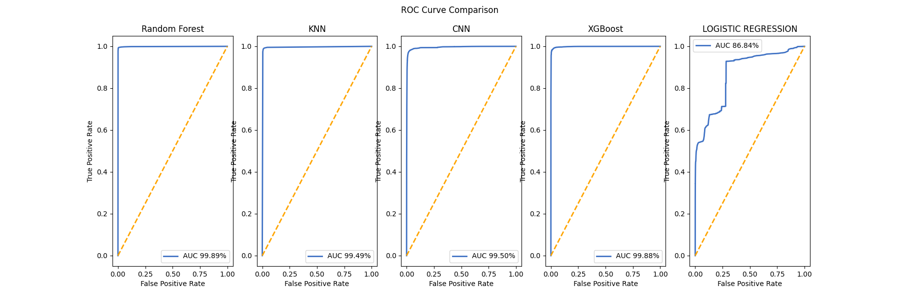
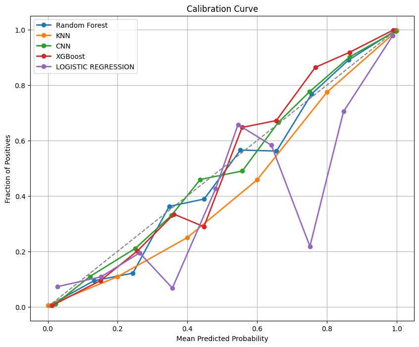

# Intrusion Detection System (IDS) Project

## Overview
This project focuses on developing an Intrusion Detection System (IDS) using machine learning models. The system analyzes network traffic data to classify it as either safe or malicious, leveraging features such as flow duration, packet length statistics, and inter-arrival times.

The project is organized into several stages:
1. **Data Preparation**: Prepares the dataset for analysis.
2. **Model Training and Evaluation**: Trains machine learning models and evaluates their performance.
3. **Real-Time Packet Analysis**: Captures network traffic, extracts features, and predicts whether the traffic is safe or malicious.

---

## Features
- **Data Loading and Preparation**: Includes utilities to load datasets and preprocess them for training.
- **Machine Learning Models**: Implements models such as Random Forest and K-Nearest Neighbors (KNN) for traffic classification.
- **Real-Time Prediction**: Extracts features from captured packets and makes real-time predictions.
- **Visualization**: Provides metrics visualizations for model performance.

---

## Prerequisites
Ensure you have the following installed:
- Python 3.8+
- Required Python libraries:
  ```bash
  pip install pandas numpy scikit-learn tensorflow matplotlib seaborn
  ```
- [Scapy](https://scapy.net/) for network packet analysis.

---

## Project Structure

### Files
- **`Real_time_packet_analysis.ipynb`**: Implements the feature extraction and prediction pipeline.
- **`Data Preparation.ipynb`**: Prepares and processes datasets.
- **`Models and Evaluation.ipynb`**: Trains models and evaluates their performance.

### Key Features in Each Notebook

#### `Real_time_packet_analysis.ipynb`
- Demonstrates loading a pre-trained Random Forest model (`random_forest_model.pkl`).
- Provides sample code for feature extraction from packets and prediction.
- Includes commented code for real-time packet capturing and feature extraction.

#### `Data Preparation.ipynb`
- Downloads and extracts IDS datasets.
- Combines multiple data files into a single Pandas DataFrame.
- Prepares balanced datasets for training and testing.

#### `Models and Evaluation.ipynb`
- Trains models like Random Forest,KNN,CNN,XGBoost,Logistic Regression.
- Evaluates models using metrics such as accuracy, F1-score, recall, precision, and ROC-AUC.
- Includes utility functions for comparing model performance and plotting metrics.

  
  `
            

---

## How to Run

### Step 1: Prepare the Dataset
1. Download the dataset from the provided link.
2. Extract and load the dataset using the `Data Preparation.ipynb` notebook.

### Step 2: Train Models
1. Open the `Models and Evaluation.ipynb` notebook.
2. Train and evaluate the models on the prepared dataset.

### Step 3: Real-Time Prediction
1. Open the `Real_time_packet_analysis.ipynb` notebook.
2. Load the pre-trained model (`random_forest_model.pkl`).
3. Use the provided code to capture packets and make predictions.
4. select the loopback option to to track on a loop
5. run the command ping -t -l 60000 < IPV4 ADDRESS > in cmd prompt,which sends the packets to your pc which resemblems like the dos attack.

---

## Example Usage

### Predicting Malicious Traffic
Load a sample feature set and predict its classification:
```python
malicious_record = [
    [6000, 3500.000, 570.000000, 2900.000000, 580, 1540.000000, 600.00, 450.000000, 320.000, 150.000]
]
predictions = loaded_model.predict(malicious_record)
print("Prediction:", "Malicious" if predictions[0] == 1 else "Safe")


```

## Future Improvements
- Integrate deep learning models for enhanced accuracy.
- Expand real-time detection to support distributed networks.
- Improve feature extraction for encrypted traffic.


